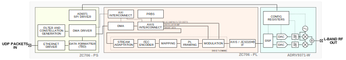

# Phase4 DMT - Transmit Test System (Ham Expo 2021 Demo)

This branch contains the DMT transmit test and demonstation system. The system overview is presented below:

.

## TODO List

#### Transmitter

- [x] PL Scrambler
- [x] PL signaling/pilot insertion
- [x] Dummy frame insertion
- [ ] Integrate code from BB filter/quadrature modulation and from DVB FPGA

#### Demo Setup

- [ ] Vivado project setup for ZC706 board
  - [ ] Zynq DMA setup for PS -> PL transfer
  - [ ] AXI Lite / Stream routing structure
  - [ ] Create RTL module from AD's JESD204B code which be instantiated to the PL top level - Note: AD's github repo might have some of this already

- [ ] PS Linux setup
  - [ ] Initial bring-up
  - [ ] DMA driver test
  - [ ] Integrate AD's AD9361 C configuration library

#### Test Setup

- [x] All ORI West Lab PC parts ordered
- [x] All ORI West Lab PC parts received
- [x] ORI West Lab PC built
- [x] ORI West Lab PC shipped (Two dead hard drives, broken glass door of case, shipping all non-broken things no earlier than 2 April 2021)
- [ ] DVB-S2X commercial gear recognized in ORI West Lab PC
- [ ] DVB-S2X commercial gear tested in ORI West Lab PC
- [ ] Configure commercial DVB-S2X demodulator for demo verification

#### Miscellaneous 
- [x] Add `phase4ground/dvb_fpga` as Git submodule
